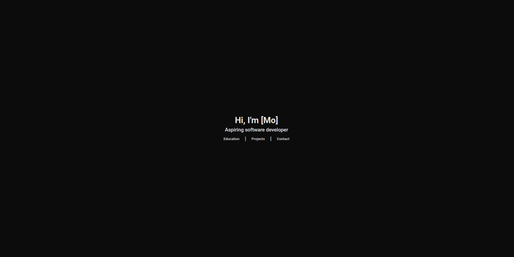

# **Personal Site V1**



## **Usage**
**Clone the repository and enter the following commands:**
```
cd personal-site-v1/
```

```
npm install
```

```
./build.sh
```

```
node server.js
```
**Successful output will be:**
```
http://localhost:5001
```

## **Possible Errors with Usage**

Your output after running ./build.sh may say something such as 'permission denied'. To fix this enter the following commands:

In the root directory of the project:
```
chmod +rwx *.sh
```

```
cd scripts
```

```
chmod +rwx *.sh
```
